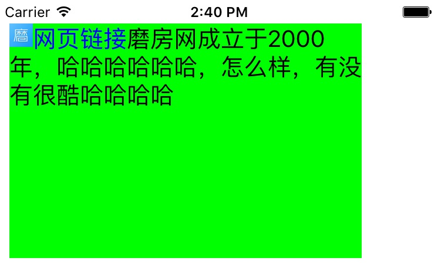
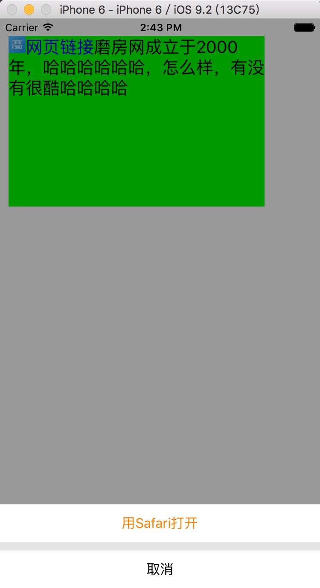

# HJLinkClickedLabel

##导航

导入头文件

 ```Objective-C
#import "HJContentTextView.h"
 ```

不需要遵循任何协议，

当然，也可以按照自己的需要修改源码，增加协议

###Demo截图



###结合HJPresentListView效果更酸爽 [ HJPresentListView]
(https://github.com/CoderHJZhao/HJPresentListView)




###说一说为什么要做这样的一个控件的初衷

虽然GitHub上已经有非常优秀的YYLabel,TTTAttributedLabel等非常优秀的识别文字中链接的第三方库，但是TTTAttributedLabel亲测无法调节行间距，无法在文字中插入图片，而YYLabel虽然可以达到我想要的效果，但是代码关联太多，我看了Demo还是一头雾水，整理成本我觉得也非常高，所以索性在网上查了些资料，自己写了一个适合自己公司项目用的控件，虽然开放的接口不多，但是可定制化个人觉得比以上两款要高，而且学习成本也要低很多。欢迎大家使用！如果大家有什么建议也可以通过下面的微博私信我，感激不尽！

（更多iOS开发干货，欢迎关注  [微博@3W_狮兄 ](http://weibo.com/hanjunzhao/) ）

----------
Posted by  [微博@3W_狮兄 ](http://weibo.com/hanjunzhao/))  
原创文章，版权声明：自由转载-非商用-非衍生-保持署名 | 

